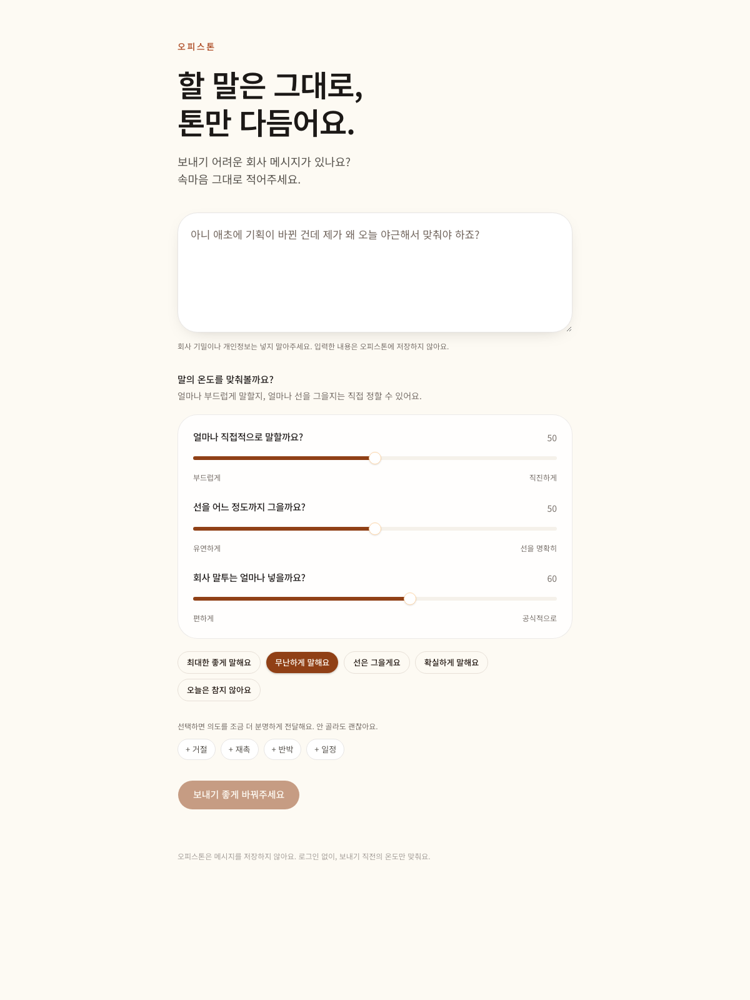

# 오피스톤 (Office Tone)

할 말은 그대로, 톤만 다듬어요.

보내기 전에, 말의 온도만 맞춰요.

오피스톤은 회사 메시지를 더 착하게 만드는 변환기가 아닙니다. 직장에서 하고 싶은 말은 분명한데, 어느 수위로 말해야 할지 모를 때 **직진도 · 방어도 · 비즈니스도**만 조절합니다.

입력은 **내가 하고 싶은 말(raw reply)** 이 기본입니다. 필요하면 **상대가 한 말이나 상황(context)** 을 추가합니다. context는 근거일 뿐, 예쁘게 다시 쓰는 대상이 아닙니다.

## Public URL

https://office-tone-1037271057097.asia-northeast3.run.app



## 왜 만들었는가

AI 말투 교정기는 쉽게 사용자를 양보하게 만듭니다.

원문이 `오늘은 못 합니다`인데 결과가 `최대한 검토해보겠습니다`가 되면, 그 제품은 실패한 것입니다.

오피스톤은 감정은 걷어내되 입장은 지킵니다.

## 3-axis communication model

| 축 | 낮음 | 높음 |
| --- | --- | --- |
| 직진도 | 부드럽게, 완곡하게 | 입장을 우회하지 않음. 공격이 아님 |
| 방어도 | 유연하게, 함께 풀어보자 | 책임과 약속을 명확히. 없는 사실을 만들지 않음 |
| 비즈니스도 | 사내 메신저 | 공식 메일/고객/임원. 구식 문투 금지 |

세 축은 1–99입니다. Preset은 템플릿이 아니라 slider 값만 바꿉니다.

- 최대한 좋게 말해요 `20 / 30 / 65`
- 무난하게 말해요 `50 / 50 / 60`
- 선은 그을게요 `55 / 85 / 70`
- 확실하게 말해요 `80 / 70 / 65`
- 오늘은 참지 않아요 `99 / 80 / 40`

## Architecture

```text
Browser  →  Cloud Run (Next.js)  →  GoVail api.govail.cloud/v1  →  worker (Qwen3.6, low-latency)
```

로그인 없음. DB 없음. 원문/결과 저장 없음. API Key는 서버에만 있습니다.

자세한 구조는 [`architecture.md`](architecture.md)를 보세요.

## Privacy

입력한 내용은 오피스톤에 저장하지 않습니다. 애플리케이션 로그에는 request id, latency, status, model, token usage, validation, retry count만 남깁니다. 원문과 생성 본문은 남기지 않습니다.

회사 기밀이나 개인정보는 넣지 말아주세요. 업스트림인 GoVail은 요청 처리 과정에서 모델을 호출합니다. 키는 서버 사이드에서만 사용합니다.

## Local development

```bash
pnpm install
cp .env.example .env.local
# GOVAIL_API_KEY를 채웁니다
pnpm dev
```

## Environment variables

| Name | Example | Notes |
| --- | --- | --- |
| `GOVAIL_BASE_URL` | `https://api.govail.cloud/v1` | OpenAI-compatible |
| `GOVAIL_API_KEY` | server-only | never `NEXT_PUBLIC_` |
| `GOVAIL_MODEL` | `worker` | low-latency slot |
| `GOVAIL_TIMEOUT_MS` | `25000` | request timeout |

## GoVail integration

Server route `POST /api/rewrite` calls `/v1/chat/completions`.

- body: `{ rawReply, context?, directness, defensiveness, business, intent? }` — axes 1–99. `thought`/`situation` aliases still work.
- model: `worker`
- `reasoning_effort: none` (this is not a reasoning workload)
- `response_format: json_object`
- 1 regenerate if Chinese contamination, empty output, or fewer than 2 candidates is detected
- model JSON `{ v: [2–3 messages], kept }` → API `{ rewritten, candidates, preserved }`
- 결과는 공문체/번역체가 아니라 사람이 메신저에 치는 한국어여야 한다

## Testing

```bash
pnpm test
pnpm test:unit
pnpm test:quality   # needs GOVAIL_API_KEY
pnpm test:e2e
E2E_LIVE=1 E2E_BASE_URL=https://office-tone-1037271057097.asia-northeast3.run.app pnpm test:e2e:live
```

`pnpm test`는 `src/` 단위·계약 테스트와 `tests/` 품질 테스트를 모두 수집합니다. 품질 라이브 테스트는 `GOVAIL_API_KEY`가 있을 때만 활성화되며, CI의 기본 검증은 외부 모델 호출 없이 결정적으로 실행됩니다. PR과 `main` push에서는 GitHub Actions가 lint, 전체 테스트, production build, Playwright smoke test를 순서대로 실행합니다.

Fixture types: 거절, 책임 경계, 재촉, 반박, 상사, 고객, role reversal. Parameter matrix is in `src/lib/ai/quality.ts`.

## Deployment

GCP Cloud Run, project `govail-500114`, region `asia-northeast3`. See [`docs/operations.md`](docs/operations.md).

```bash
docker build -t office-tone .
docker run --rm -p 8080:8080 --env-file .env.local office-tone
```

## Scope

계정, 회사 persona, 빌링, RAG, 에이전트 워크플로는 MVP에 없습니다. 구조만 막지 않습니다.
