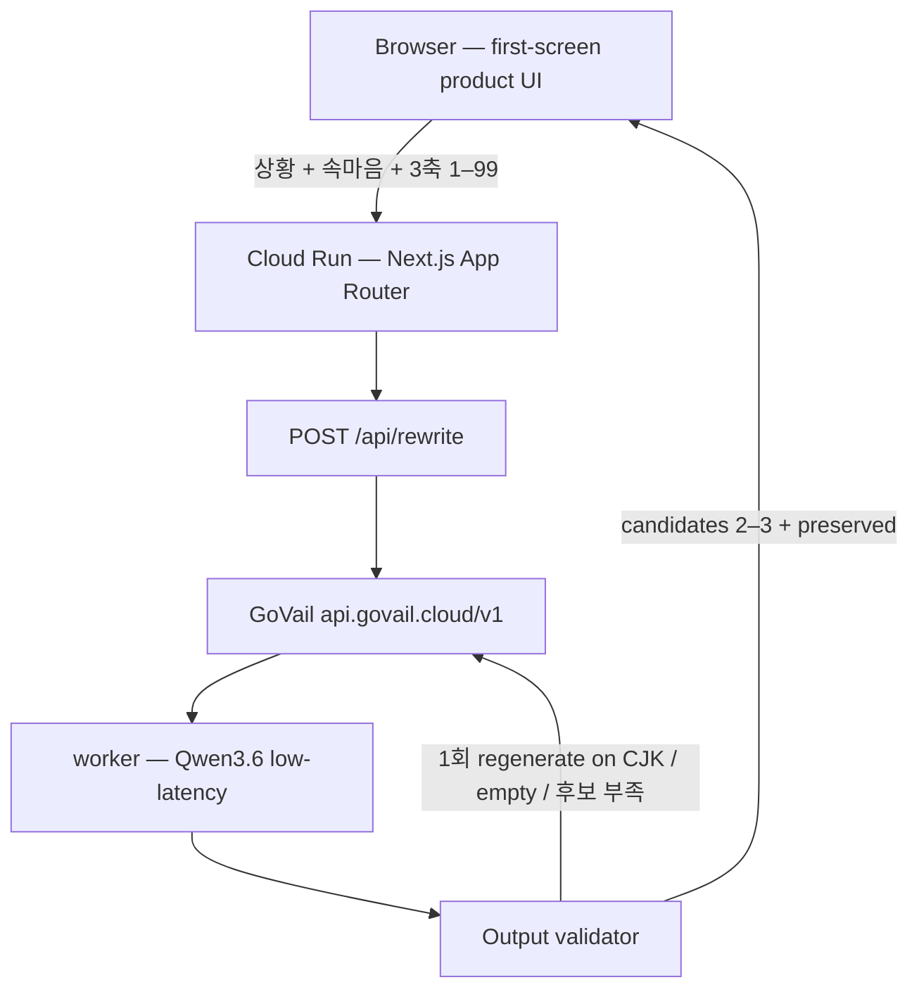

# 오피스톤 Architecture

## Runtime

| Layer | Choice |
| --- | --- |
| App | Next.js App Router, TypeScript, Tailwind, shadcn/ui |
| Hosting | GCP Cloud Run `office-tone` in `govail-500114` / `asia-northeast3` |
| AI | GoVail OpenAI-compatible `/v1/chat/completions` |
| Default model | `worker` (fast Qwen3.6). `reasoning_effort: none` |
| Data | None. No DB, no auth, no message persistence |

## Request path

1. Client sends `{ situation, thought, directness, defensiveness, business, intent? }`. Axes are 1–99.
2. `situation` is the cause/original context. `thought` is what the user wants to say. Server never forwards either into the system prompt; they are the `user` message only.
3. Prompt SSOT: `src/lib/ai/prompts.ts`.
4. Model returns JSON `{ v: [2–3 sendable messages], kept: [...] }`. Validator accepts mangled keys and strips leaked label lines. One regenerate max.
5. Response logs request id, latency, status, model, tokens, validation, retry — never raw text.

## Calibration rules

- Results must read like a Korean coworker, not a translated memo.
- Extreme venting is intensity, not a sendable ultimatum. Low directness restates the underlying workplace demand.
- Do not invent deadlines, reports, apologies, or disciplinary power the user did not state.

## Privacy

Input is processed in-memory for a single request. Application logs omit original and rewritten bodies.
